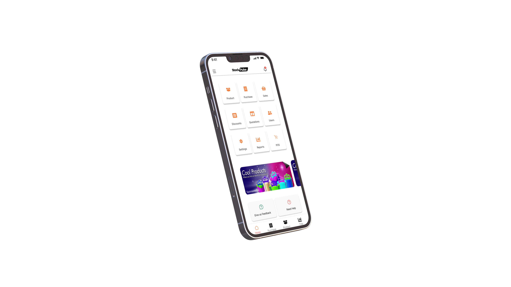

# Sales Management App with POS System

## Description

The Sales Management App is a comprehensive mobile application designed to streamline and simplify the process of managing sales activities, tracking inventory, and optimizing overall business operations. The app includes a robust Point of Sale (POS) system for seamless transactions.

## Table of Contents

- [Features](#features)
- [POS System Features](#pos-system-features)
- [Screenshots](#screenshots)
- [Installation](#installation)
- [Usage](#usage)
- [Technologies Used](#technologies-used)
- [Contributing](#contributing)
- [License](#license)

## Features

### 1. Product Management

- Efficiently manage your product catalog.
- Add, edit, and delete products with ease.
- Track product availability and stock levels.

### 2. Sales Tracking

- Record and track sales transactions.
- View sales history and analyze performance.
- Generate sales reports for insights.

### 3. Customer Management

- Maintain a database of customer information.
- Track customer interactions and purchase history.
- Improve customer relationships and loyalty.

### 4. Inventory Management

- Monitor and manage inventory levels.
- Receive low stock alerts to prevent stockouts.
- Easily reorder products based on demand.

### 5. User Authentication

- Securely log in and authenticate users.
- Role-based access control for different user levels.

## POS System Features

### 1. Point of Sale (POS)

- Conduct seamless and secure transactions.
- Support for various payment methods (cash, card, etc.).
- Generate and print receipts for customers.

### 2. Order Management

- Create and manage customer orders.
- Customize orders and add discounts if applicable.
- Track order status in real-time.

### 3. Sales Analytics

- Analyze POS data for sales trends.
- Gain insights into popular products and customer preferences.
- Make data-driven decisions to optimize sales.

## Screenshots

Include screenshots or GIFs of your app to showcase its user interface and functionality.




## Installation

1. Clone the repository:

    ```bash
    git clone https://github.com/KMaina-N/stockpulse.git
    ```

2. Navigate to the project directory:

    ```bash
    cd stockpulse
    ```

3. Install dependencies:

    ```bash
    npm install
    ```

4. Run the app:

    ```bash
    npm start
    ```

## Usage

Describe how users can use your app effectively. Provide any necessary instructions or guidelines.

## Technologies Used